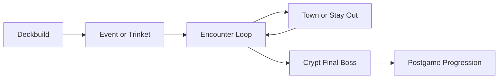

# MTG Roguelike — Rules Repository

A cooperative, long-form Commander roguelike where players form a party and push through Host-controlled encounters on the way to the **Crypt**.

## Start Here

If you are new, read these in order:

1. [CORE-RULES.md](CORE-RULES.md)
2. [CORE-GAME-STRUCTURE-V1.0.md](CORE-GAME-STRUCTURE-V1.0.md)
3. [ENCOUNTER-SYSTEM-V1.0.md](ENCOUNTER-SYSTEM-V1.0.md)
4. [TOWN-SYSTEM-V2.0.md](TOWN-SYSTEM-V2.0.md)

## At a Glance

| Category | Details |
| :--- | :--- |
| Run Length | **4-6 hours** |
| Setup Time | **20-40 minutes** |
| Players | **1-6 players** |
| Format | Co-op PvE (Host vs Party) |
| Progression | Persistent (Tickets, Brands, Captures, Achievements, Crypt Buffs) |
| Best For | Dedicated game-night groups |

## Run Flow



Standard path usually resolves in 3 encounters before the Crypt. Variant path can extend to 4 encounters.

## What's New

- Last updated: **2026-05-06**
- Index and onboarding flow were updated to improve first-time readability.
- Run length is now explicitly surfaced as a **4-6 hour** event-length experience.

---

## 📖 Document Index

### Before a Run (Persistent)

| Document | Description |
| :--- | :--- |
| [PERMANENT-PROGRESSION.md](PERMANENT-PROGRESSION.md) | Current Season 1 Crypt Buffs, Tickets, Brands, and Achievements |
| [ESSENCE-COUNTER-FUNCTIONALITY.md](ESSENCE-COUNTER-FUNCTIONALITY.md) | In-game progression tool behavior, unlock flow, reward spawning, and profile sync |
| [EXPERIMENTAL-CRYPT-BUFF-PROGRESSION.md](EXPERIMENTAL-CRYPT-BUFF-PROGRESSION.md) | Experimental Crypt Buff unlock track based on cumulative Crypt wins |
| [SHOPS.md](SHOPS.md) | Progression Shop — captures, tickets, Brands, and long-term purchases |

### Run Start (Setup and Deckbuilding)

| Document | Description |
| :--- | :--- |
| [CORE-RULES.md](CORE-RULES.md) | Core rules, player structure, commander selection, deck construction, and global limits |
| [SHOPS.md](SHOPS.md) | Pregame Shop — commander mulligans, partner/background access, and pregame purchases |
| [BRANDS-SYSTEM-V1.0.md](BRANDS-SYSTEM-V1.0.md) | Persistent deckbuilding Brands purchasable before or after a run |
| [TRINKET-SYSTEM-V1.0.md](TRINKET-SYSTEM-V1.0.md) | Pre-first-encounter Trinket selection flow and Trinket Ticket override |

### Encounter Loop (During the Run)

| Document | Description |
| :--- | :--- |
| [CORE-GAME-STRUCTURE-V1.0.md](CORE-GAME-STRUCTURE-V1.0.md) | Run structure, game loop, objective, failure conditions |
| [ENCOUNTER-SYSTEM-V1.0.md](ENCOUNTER-SYSTEM-V1.0.md) | Encounter types, flow, setup, and the Crypt |
| [AFFIXES-V1.0.md](AFFIXES-V1.0.md) | Tiered encounter modifiers (Tier 1–4) with XP bonuses |
| [DOOM-SYSTEM-V1.0.md](DOOM-SYSTEM-V1.0.md) | Host's triggered ability cards, drawn per player count |
| [HOST-AUTHORITY-SYSTEM-V1.0.md](HOST-AUTHORITY-SYSTEM-V1.0.md) | Host scaling buffs and Arcane Suppression |
| [REWARD-SYSTEM-V1.0.md](REWARD-SYSTEM-V1.0.md) | XP, Cash Out, and Loot Pool after each encounter |
| [TOWN-SYSTEM-V2.0.md](TOWN-SYSTEM-V2.0.md) | Town buildings — Bank, Bazaar, Blacksmith, Cathedral, Merchant, Mystic, Portal, Tavern, The Guild |
| [TRAVELERS-V1.0.md](TRAVELERS-V1.0.md) | Special visitors that appear in Town — unique benefits that do not cost a Town Action |
| [STAY-OUT-SYSTEM-V1.0.md](STAY-OUT-SYSTEM-V1.0.md) | Rules for skipping Town — XP scaling, Supply Drops, Wanderers |
| [SUPPLY-DROP-SYSTEM.md](SUPPLY-DROP-SYSTEM.md) | Scavenged resource resolution between encounters |
| [EVENT-SYSTEM-V1.0.md](EVENT-SYSTEM-V1.0.md) | Between-encounter random events — types, timing, frequency |
| [DEMON-GENERALS-V2.0.md](DEMON-GENERALS-V2.0.md) | Tyrant Generals — passives, signature moves, relics |

### Run Finale

| Document | Description |
| :--- | :--- |
| [CORE-RULES.md](CORE-RULES.md) | Crypt and win condition reference |
| [ENCOUNTER-SYSTEM-V1.0.md](ENCOUNTER-SYSTEM-V1.0.md) | Crypt setup and final encounter behavior |

### After a Run (Postgame)

| Document | Description |
| :--- | :--- |
| [SHOPS.md](SHOPS.md) | Progression Shop — spending post-run resources and buying permanent upgrades |
| [PERMANENT-PROGRESSION.md](PERMANENT-PROGRESSION.md) | Permanent unlock reference for player progression layers |

### Progress Tracking

Profile progression is tracked by the in-game tool, which manages **Essence, Achievements, Crypt Buffs, Tickets, Brands, and Captures** and saves/loads player data from a Google Sheet.

See [ESSENCE-COUNTER-FUNCTIONALITY.md](ESSENCE-COUNTER-FUNCTIONALITY.md) for the full functional breakdown.

---

## 🎮 Quick Overview

### How a Run Works

```
Standard: Deckbuild → Event/Trinket → Encounter 1 → ... → Encounter 3 → Crypt
Variant:  Deckbuild → Event/Trinket → Encounter 1 → ... → Encounter 4 → Crypt
```

### Player Count
- Supports **1–6 players**
- Host Health, Rewards, Doom cards, and Authority all scale with player count

### Win Condition
Defeat the **Crypt** (Final Boss) at the end of the run.

### Loss Condition
The run ends only if the party fails to defeat the Crypt.

Failed encounters do not end the run immediately: the party gains no Rewards from that encounter, but must still choose to go to Town or Stay Out between stages.

On a failed encounter, skip Rewards (XP, Cash Out, and Loot Pool) but still proceed to the Post-Encounter Choice (Town or Stay Out). Missing Rewards is the only penalty.

---

## 🤝 Contributing

See [CONTRIBUTING.md](CONTRIBUTING.md) for how to submit rule change requests, flag bugs, and propose new content.
